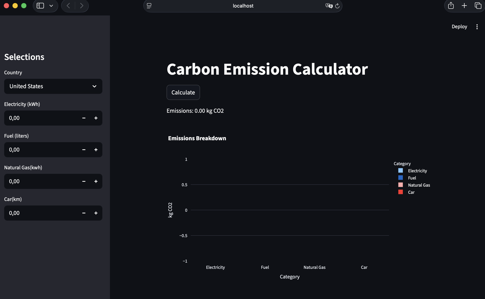

# 🌍 Carbon Emission Calculator

A Streamlit web app that calculates and visualises your carbon footprint based on 
electricity, fuel, natural gas, and car usage — with real emission factors by country.


## Features

- 🌐 Country selector powered by real electricity emission data from CSV
- ⚡ Calculates CO2 emissions across four categories: electricity, fuel, natural gas, and transport
- 📊 Interactive Plotly bar chart showing emissions breakdown
- 🧮 Clean separation between calculation logic and UI

## Project Structure
carbon-footprint-calculator/
├── carbon_footprint.py         # Emission factor logic and calculation
├── dashboard.py                # Streamlit UI
├── carbon-intensity-electricity.csv  # Real-world electricity emission data
├── requirements.txt
└── README.md
## Installation

```bash
git clone https://github.com/your-username/carbon-footprint-calculator
cd carbon-footprint-calculator
pip install -r requirements.txt
```

## Usage

```bash
streamlit run dashboard.py
```

Then open http://localhost:8501 in your browser.

## Requirements
streamlit
pandas
plotly

## Data Source

Electricity carbon intensity data sourced from real-world emissions datasets 
(gCO₂/kWh converted to kg CO₂/kWh).

## License

MIT